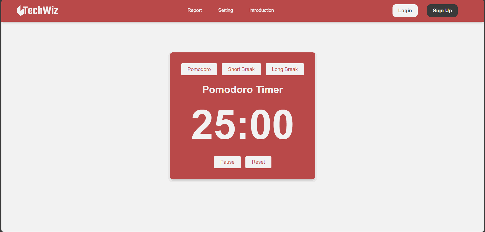

# TomoTime

## English

TomoTime is an advanced time management tool designed to help individuals and teams optimize their daily schedules, enhance productivity, and achieve their goals efficiently. By combining simplicity with powerful features, TomoTime offers a seamless experience for planning, tracking, and analyzing your time.

### Outstanding Features
- **Pomodoro Timer**: Create a certain time period (25 minutes) to help us focus on working during this time.
- **Short Break**: Create a break during Pomodoro Timer (5 minutes). A suitable time for us to relax before continuing.
- **Long Break**: Create a rest period when going through Pomodoro Timer (15 minutes). 1 more "Short Break" timeline for us to relax before continuing.

### TomoTime interface?
- Friendly interface, cool colors create a comfortable feeling.
- Support for personal and professional time management.
- Integration with popular performance tools (Not available yet).

### Project
- This is the pomotime project demo. The initial project established the interface and timer functionality.  
- My first small personal project at techwiz.

---

## Tiếng Việt

TomoTime là một công cụ quản lý thời gian ngắn hạn, giúp cá nhân và nhóm tối ưu hóa lịch trình hàng ngày, nâng cao hiệu suất làm việc và đạt được mục tiêu một cách hiệu quả. Kết hợp giữa tính đơn giản và những tính năng mạnh mẽ, TomoTime mang đến trải nghiệm mượt mà cho việc lên kế hoạch, theo dõi và phân tích thời gian.

### Tính Năng Nổi Bật
- **Pomodoro Timer**: Tạo khoảng thời gian nhất định (25 phút) giúp chúng ta tập trung làm việc trong khoảng thời gian này.
- **Short Break**: Tạo thời gian nghỉ ngơi khi trải qua thời gian Pomodoro Timer (5 phút). 1 mốc thời gian phù hợp để chúng ta thư giãn trước khi tiếp tục.
- **Long Break**: Tạo thời gian nghỉ ngơi khi trải qua thời gian Pomodoro Timer (15 phút). 1 mốc thời gian nhiều hơn "Short Break" để chúng ta thư giãn trước khi tiếp tục.

### Giao diện TomoTime?
- Giao diện thân thiện, màu sắc mát mẻ tạo cảm giác thoải mái.
- Hỗ trợ quản lý thời gian cá nhân và chuyên nghiệp.
- Tích hợp với các công cụ nâng cao hiệu suất phổ biến (Chưa có).

### Dự án
- Đây là demo dự án pomotime. Dự án ban đầu đã thiết lập giao diện và chức năng bấm giờ.  
- Dự án cá nhân nhỏ đầu tiên của tôi tại TechWiz.

